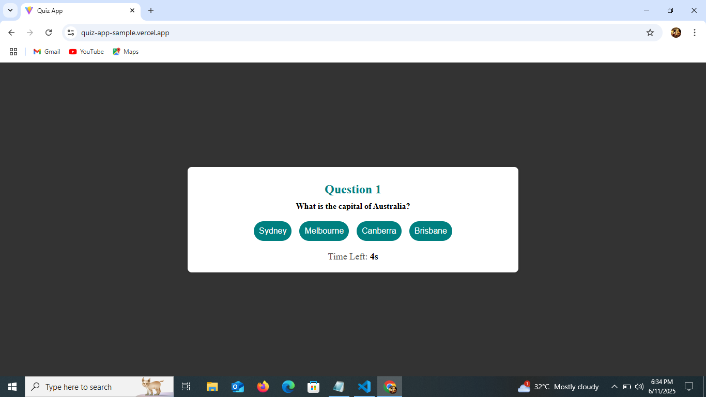
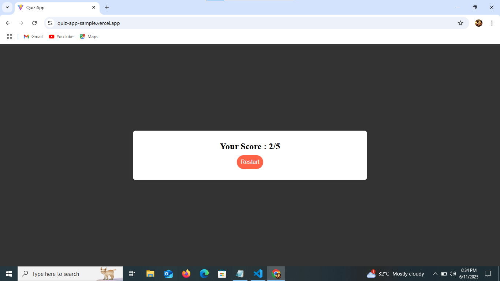

# React Quiz App with Timer

A simple quiz application built using React. The app displays multiple-choice questions with a timer for each, calculates the score, and allows quiz restart.

## Live Demo

🔗 [Live Demo](https://quiz-app-sample.vercel.app/)  

## Developed By  
**Gayathri G**  
GitHub: [GAYATHRI1006](https://github.com/GAYATHRI1006)

## Screenshot






## Features

- Displays one question at a time  
- Multiple choice options  
- 10-second timer for each question  
- Score tracking  
- Restart quiz functionality  
- Responsive and clean UI  

## Getting Started

### 1. Clone the Repository

```bash
git clone https://github.com/GAYATHRI1006/Quiz_App.git
```

### 2. Install Dependencies

```bash
npm install
```

### 3. Run the App

```bash
npm run dev
```

## Tech Stack

- **React**
- **JavaScript**
- **HTML5**
- **CSS3**          
